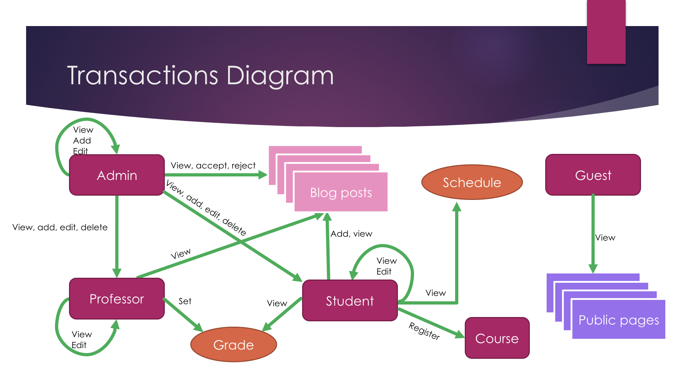

---
layout: project
type: project
image: images/homepageweb.png
title: Arab Academy University Portal
permalink: projects/web
date: 2016
labels:
  - Web development
  - JavaScript
  - HTML
  - PHP
  
summary: Worked on developing university portal serving students, professors, admins and guests.
---

■ Developed complete backend and frontend of client-server website for my university students, professors, admins and guests      with various new features and transactions in HTML, Javascript, CSS, Bootstrap, PHP, SQL
■ Designed and built relational database as part of backend
■ Implemented a number of web development concepts
  ● Handled SQL injection
  ● Role Authorization
  ● Data Validation
  ● Session timeout
  ● Pagination controls
  ● Classified structure for code

Better illustration of the project can be found in the presentation [here](https://drive.google.com/open?id=0B-VhYYVAauuFVm5Tdll4YlNTd1k).

