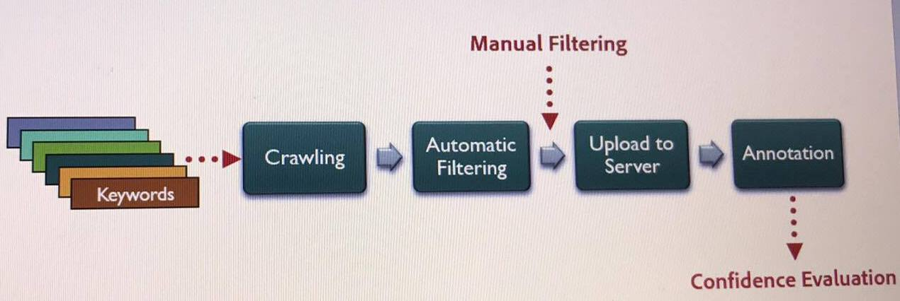

  

Several algorithms have been developed to aid in harmonically compositing a 3D object in a 2D image while still looking realistic and pleasing. Project Felix plans to offer this service to non-specialist end users by identifying the ground-plane in an image through estimating the horizon using a state-of-the-art convolutional neural network. Although the current CNN attains a great performance on certain types of images, it fails on other images with some specific content. This is due to the nature of the training SUN360 panoramic Dataset. The project lays the foundation of a pipeline to collect and annotate an expandable specialized dataset that handles the failure cases of the CNN.

The first stage of the project is crawling flickr images with a combination of keywords. The python crawler saves images and their EXIF metadata in JSON format. Automatic filtering is then applied after camera model to sensor size mapping and focal length computation to discard the images with the missing parameters. The third stage takes in manually-filtered images from previous stage after removing irrelevant images. Finally, the images are uploaded to a server for crowdsourcing annotation. Annotation is done by a tool that takes in camera's field of view and focal length to adjust camera's parameter. Then, by selecting 4 points ont he ground plane, the normal vector is computed from which the horizon is computed. To ensure the consistency of the results, a short survey is designed at the end of each annotation to calculate confidence score for each image using weighted standard deviation.

