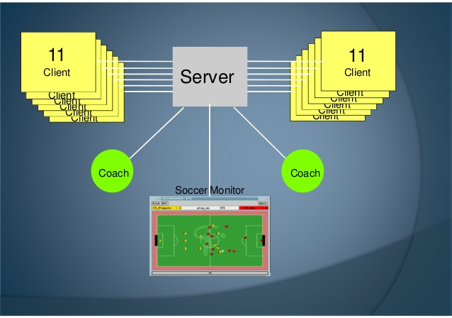

LeftEagle is a newly founded soccer 2D simulation team participated in Robocup international competition in 2016, Germany. The base code that LeftEagle uses is agent2d 3.1.1 and librcs 4.1.0. For creating new formations and debugging the matches, fedit2 and soccerwindow2 were used. LeftEagle implemented improvements in dribbling, marking, actions’ evaluation, formations and strategy. The main focus of LeftEagle was to improve the defensive mode and enhance the ball possession to decrease the probability of the opponents to score goals. LeftEagle also created an online wiki, the first wiki supported in English to aid newbies in getting started with their development. Detailed description of the project can be found in the team description paper [here](https://drive.google.com/open?id=0B-VhYYVAauuFbU4yX25KUFQwLVE).

Source: <a href="https://github.com/Nouran-Soliman/Robocup-Soccer-2D-simulation"><i class="large github icon"></i>Robocup Soccer 2D Simulation</a>
