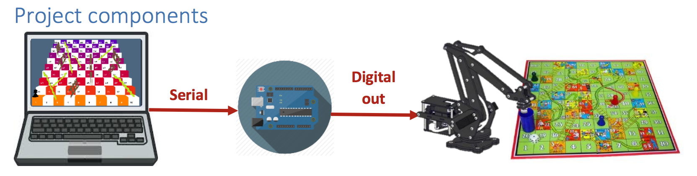

Designed and built a full system for entertainment purposes consisting of a software game with its hardware prototype controlled by communication between them. The project has 2 major components: a software simulation of the game and a hardware prototype of the real game with interaction between them. On the software side, the players roll the dice in succession and accordingly move to the destination cell. The software then communicates with the hardware prototype to imitate the exact game-play. The software communicates with the hardware prototype Arduino using serial communication. For each dice roll, the computer game sends the destination cell number to the Arduino which controls a 5-degree-of-freedom arm (base, elbow, shoulder, wrist and gripper) that picks up the current player and places it to the destination cell on the real board using hard-coded positioning.

Better illustrations are found in the presentation [here](https://drive.google.com/open?id=0B-VhYYVAauuFZmJGcm9nZVFCczQ).

Detailed description of the project can be found in the report [here](https://drive.google.com/open?id=0B-VhYYVAauuFekZPR052b1R1RWM).
